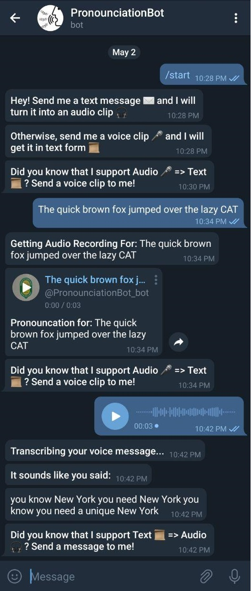

# Pronounce It Bot

A python bot that utilizes the Telegram API to allow users to send text to be converted to audio and audio clips turning into text.

## Requirements

* Python 3
* [ffmpeg](https://www.ffmpeg.org/download.html) (for version of audio files to compatible formats)
* Various Python Dependancies (can be easily installed from the requirements.txt)

## Configuration

### Creating a Bot in Telegram
*This section is for instructions on creating a bot in Telegram, if you have created a bot and have its token, you can skip this step*

If you have not created a bot before. You will need to message the [BotFather](https://t.me/botfather) who will guide you on how to create a bot. You will be given a Telegram token which you will need to configure the bot. Please make sure this token is kept in a safe place & not viewable to the public.

For more information on how to create a bot, you can view the official Telegram guide located [here](https://core.telegram.org/bots).

### Setting up the Pronounciation Bot

The .env-sample file is a copy of what the bot expects in a .env file and is quite straightforward.

```
TELEGRAM_TOKEN="<Token goes here>"
MODE="local" (Explained below in the README)
WEBHOOK_URL_MAIN="<Webhook URL Here>"
BOT_NAME="@<Bot Name Here>"
PORT=8443
```

### Local/Server Mode

There are two methods to run a bot in Telegram:
* Polling (referred to as 'local' in this guide)
* Webhooks (referred to as 'server' in this guide)

### Polling
Polling allows you to run your bot anywhere, without port forwarding, since it requests information from the Telegram servers instead of the Telegram servers requiring to send POST requests to your bot. The downside is that the bot script needs to be running to work and cannot be woken up. Should you use the webhook method, you must set the 'MODE' variable to 'local' in the .env

### Webhooks
Webhooks allows you to specify a server Telegram should POST to for your bot to work. The benefits is that you can deploy this to a server (like Heroku) and when a user attempts to interact with the bot, it will send a POST request to the server which can wake your bot up, eliminating the need to have your server up and running continuously. The downside is that you will need a server with an open port and the ability for Telegram to send POST requests to that server (the bot comes with a built-in server listener, you will not need to use an external one like Apache or Nginx). For more information, please refer to the official [Telegram Webook Guide](https://core.telegram.org/bots/webhooks). Should you use the webhook method, you must set the 'MODE' variable to 'server' in the .env

**Once you have made the changes you need, remember to rename the ".env-sample" file to ".env"**

## Methods of Running

### Docker

If you have Docker installed, Docker is the easiest way to run a copy of this bot. The Dockerfile is set up to install all dependancies and run on boot. It uses the official [python:3.8](https://hub.docker.com/_/python) image for continuous support.

Simply clone a copy of this repo , add your settings to the .env-sample file, rename the .env-sample to .env, open up a command prompt & navigate where this repo (with the Dockerfile) is stored and then run this command:

```
> docker build -t mypronounciationbot .
> docker container run mypronounciationbot
```

### Heroku
The 'Procfile' is there if you wish to deploy to Heroku or another service that supports Procfiles. Simply clone a copy of this repo, add your settings to the .env-sample file, rename the .env-sample to .env, and deploy to Heroku

*Tip:* Assuming you want to run in server mode, create your dyno first to get your Dyno URL, then add that to .env file and deploy. 

*Tip 2:* When deploying to Heroku, remember to add this buildpack in the Settings page. Otherwise, ffmpeg will not be able to convert the audio clips when a user sends a voice clip to transcribe:
```
https://github.com/jonathanong/heroku-buildpack-ffmpeg-latest.git
```
Or if you are using the Heroku CLI, run this:
```
heroku buildpacks:add https://github.com/jonathanong/heroku-buildpack-ffmpeg-latest.git
```

### Locally

If you have Python 3 installed (with pip) & ffmpeg installed (or the binary in the same directory as the repo), you can run the bot locally (after you set up your variables in the .env file)

Install the requirements:
```
python -m pip install --no-cache-dir -r requirements.txt
```

Run the bot
```
python ./bot.py
```

## Screenshots


## See It Live!

Got a Telegram Account? See it live! https://redirct.page.link/TelegramPronounciationBotLivePage

[](https://redirct.page.link/TelegramPronounciationBotLivePage)
